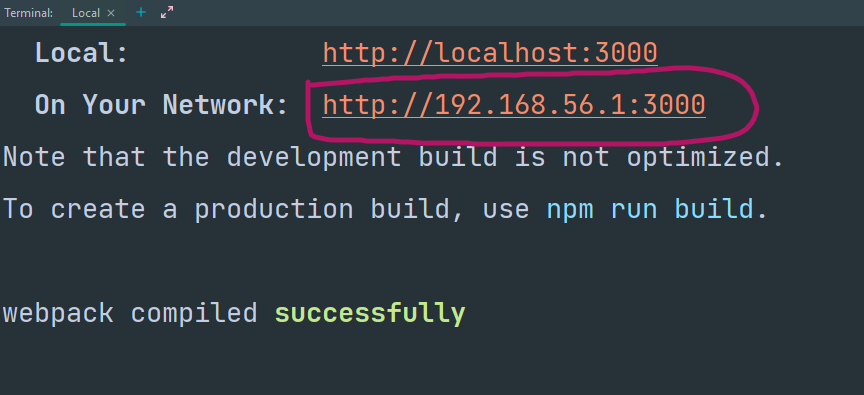
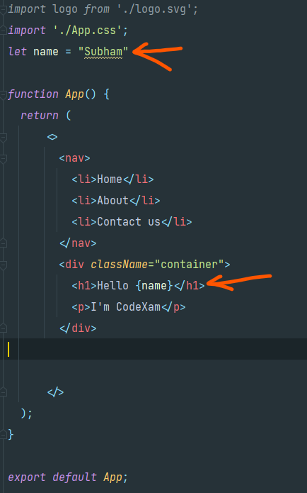
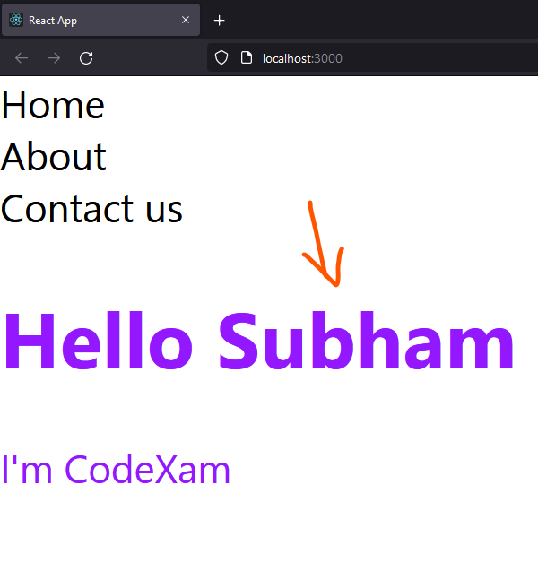
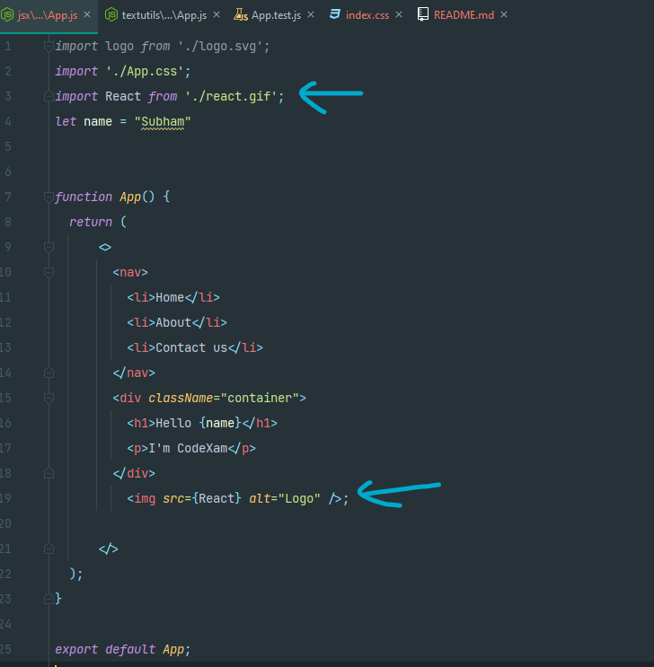
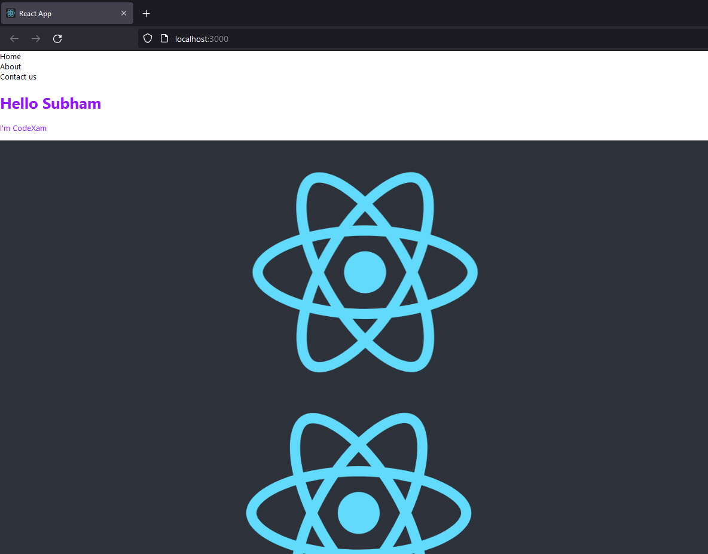

# [Reactjs Official JSX documentation ](https://reactjs.org/docs/introducing-jsx.html)

1.
```
npx create-react-app jsx
```

2. React has two types of Components:

    - **Function-based Component:** In short they are the JavaScript functions. Nowadays, Function-based components are primarily used.
    - **Class-based Component:** They are quite complexer than the function-based component as the class components can work with each other.

3. **JSX:** - It stands for Javascript XML. It is the syntax extension of Javascript which allows HTML to co-exist with Javascript in React.

**note :** 

   * You have to write "className" instead of "class" as class is the reserved keyword in Javascript
    
   * In place of "for" you have to use "htmlFor" 

 4. **JSX fragment feature:**

 - With return() we can return only one tag or Element.
 You can't do this
 ```jsx
 <h1>This is Subham</h1>
    // <div className="App">
```
 - If you want to return two elements using JSX you have to use the JSX Fragment 
 - Feature or wrap the whole content in one element. 
 
 For example, if we want to return the content of the H1 tag and Div tag together we will be using a JSX fragment ( <>.....</>).

 ```jsx
 import logo from './logo.svg';
import './App.css';

function App() {
  return (
    <>
    <h1>This is Subham</h1>
    <div className="App">
      <header className="App-header">
        
        <p>
          Edit <code>src/App.js</code> and save to reload.
        </p>
        <a
          className="App-link"
          href="https://reactjs.org"
          target="_blank"
          rel="noopener noreferrer"
        >
          Learn React
        </a>
      </header>
    </div>
    </>
  );
}

export default App;
 ```

**Tip:** Firstly make sure both devices are connected with the same Wi-Fi. If you want to see your React app on your phone, then you can use the IP address provided in the terminal.


# work
1.Changing color in css just add
```css
/*index.css*/
.container {
color: #9317ff;
}
```
2.Create a basic navbar in App.js
```jsx
// app.js
function App() {
    return (
        <>
            <nav>
                <li>Home</li>
                <li>About</li>
                <li>Contact us</li>
            </nav>
            <div className="container"><p>Hey CodeXam</p></div>

        </>
    );
}
```

3.Create a Variable and Add

```jsx
let name = "Subham"

function App() {
  return (
      <>
        <nav>
          <li>Home</li>
          <li>About</li>
          <li>Contact us</li>
        </nav>
        <div className="container">
          <h1>Hello {name}</h1>
          <p>I'm CodeXam</p>
        </div>


      </>
  );
}
```


**Output**


4.Adding Gif 

- Download a gif and copy this gif to folder jsx -> src 
- react.gif <- file name
- App.js
- ```import React from './react.gif';```    <- import this  then ```;```
```jsx
// App.js
import logo from './logo.svg';
import './App.css';
import React from './react.gif';
let name = "Subham"


function App() {
  return (
      <>
        <nav>
          <li>Home</li>
          <li>About</li>
          <li>Contact us</li>
        </nav>
        <div className="container">
          <h1>Hello {name}</h1>
          <p>I'm CodeXam</p>
        </div>
          ;

      </>
  );
}

export default App;
```


