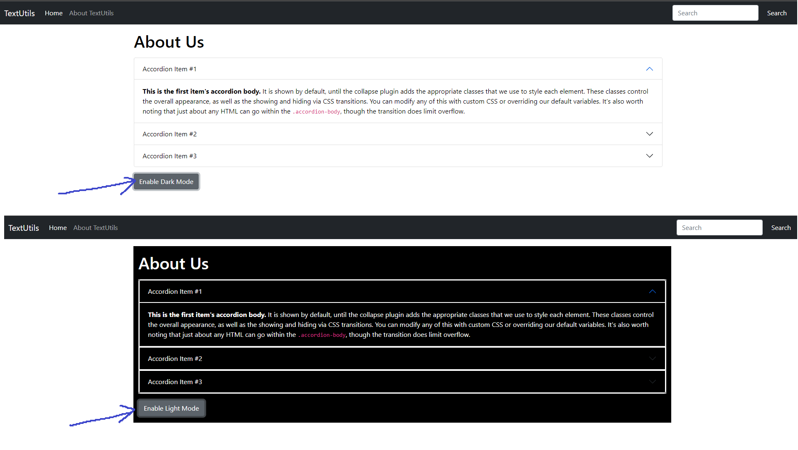

## **Create About.js:**

Create "about.js" in your components folder and by using snippet ‘rfc’ we can easily generate a function-based component of React in our "about.js". Now we will enter some components, like the Accordion component, of bootstrap in return(). Earlier we learned how to  components from bootstrap. We will learn how to use the Accordion component in return().


### **In app.js:**

Now we will render this "about.js" in the Home section of our application with the help of "app.js". So, comment out the "textform.js" and add the "about.js" file.

<p align="center">
        
        </p>

Figure1.1: Rendering About.js

Now we would like to add a button to our app. On clicking this button our app must enable or disable the dark mode. To do so we would be assigning function to this button later on.

### Bootstrap add:
From here: https://getbootstrap.com/docs/5.0/components/accordion/

### **Adding button:**

To add button we will use:


```jsx
//About.js
<button type="button" className="btn btn-primary">Enable Dark Mode</button>
```


### **What our function must do?**

On invoking the function, by clicking the button, we want that dark mode to get enabled and the text in our button to change from ‘Enable dark mode’ to ‘Enable Light Mode’ and vice versa. To do so follow the steps:

Firstly, we will add the style of dark mode to our application and then interchange it with light mode on invoking the function.


### **Adding Styles of Dark mode:**


```

style = {mystyle}
```


where ‘myStyle’ is an object which we are using as a style variable. So let’s create a JavaScript object with the name of ‘myStyle’.


```jsx
//About.js
let myStyle = {
    color: 'white',
    backgroundColor: 'black'
}
```


Remember: In JS everything is in camel case


### **Using this Style:**

We are using this style object in our three accordion buttons and body. After applying styles our app is appearing something like this:

<p align="center">
        
        </p>

Figure1.2: Our Application


### **Style as a State variable:**

Now we make this myStyle object as a state variable so we can use it to change the style of our application by clicking on the button. We would be using two-state variables:

1. myStyle as a State variable 
```jsx
const[mystyle, setMystyle] = useState({
    color: 'black',
    backgroundColor: 'white'
})
```
2. Button Text as a State variable
```jsx
const[btnText, SetBtnText] = useState("Enable Dark mode")
```
Initially, these are the State of our application and we would replace them with setMyStyle and setBtnText.


### **Function:**

We would like to change the style of our application on invoking a function, Suppose toogleStyle.

For that Create a function toggleStyle and use the if-else statement to define conditions for change.

Toggle style function :


```jsx
const toogleStyle = () => {
    if (myStyle.color === "black") {
        setMyStyle({
            color: "white",
            backgroundColor: "black",
            border: "1px solid white",
        })
        setBtnText("Enable Light Mode")
    }
}
```


**Explanation:** The above code means if the color of text of myStyle object is black(light mode) then on clicking the button change myStyle with SetMyStyle, which is replace the color of text with white and background color with black and enable border (that is Dark Mode). We have also replaced the text of the button with setBtnText, which is ‘enable light mode’.


```jsx
else {
    setMyStyle({
        color: 'black',
        backgroundColor: 'white'
    })
    setBtnText("Enable Dark Mode")
}
```


**Explanation:** If the above-mentioned conditions are false then replace myStyle with setMyStyle, this time, which is text color being black and background color being white, and replace the text in button with “Enable Dark mode”.Actually, this is the same as the initial condition of our text, which is light mode is being enabled.

Hence we have successfully created our function and would like to assign it to our button.

Code of button:


```jsx
<button onClick={toggleStyle} type="button" className="btn btn-primary"> {btntext}</button>
```


Hence, we have successfully created a button to enable dark mode in our Application.


### **Summary:**

What we have done in our about.js:

<p align="center">
        
        </p>
        
Figure1.3: A short summary

We have rendered about.js in the Home section just for the demo. So, Comment out the about component and again use the text form component. Later on, we would be rendering this about.js to the About section of our application with the help of a router.
**********************************
 **********************************
**********************************
# Entire Code of about.js:
```jsx
// About.js
import React, {useState} from 'react'
function About(){
   const [myStyle, setMyStyle]=useState({
      color: 'black',
      backgroundColor: 'white',

   })
   const [btnText, setBtnText]=useState('Enable Dark Mode')
   const toggleStyle=()=> {
      if(myStyle.color==='black'){
         setMyStyle({
            color: 'white',
            backgroundColor: 'black',
            border: '1px solid white'
         })
         setBtnText('Enable Light Mode')
      }
      else{
         setMyStyle({
                    color: 'black',
                    backgroundColor: 'white'
                 }
         )
         setBtnText('Enable Dark Mode');
      }
   }
   return (
           <div className="container" style={myStyle}>
              {/*I add my-3 for spacing*/}
              <h1 className= "my-3">About Us</h1>
              <div className="accordion" id="accordionExample" style={myStyle}>
                 <div className="accordion-item">
                    <h2 className="accordion-header" id="headingOne">
                       <button className="accordion-button" style={myStyle} type="button" data-bs-toggle="collapse"
                               data-bs-target="#collapseOne" aria-expanded="true" aria-controls="collapseOne">
                          Accordion Item #1
                       </button>
                    </h2>
                    <div id="collapseOne" className="accordion-collapse collapse show" aria-labelledby="headingOne"
                         data-bs-parent="#accordionExample">
                       <div className="accordion-body" style={myStyle}>
                          <strong>This is the first item's accordion body.</strong> It is shown by default, until the
                          collapse plugin adds the appropriate classes that we use to style each element. These
                          classes control the overall appearance, as well as the showing and hiding via CSS
                          transitions. You can modify any of this with custom CSS or overriding our default variables.
                          It's also worth noting that just about any HTML can go within
                          the <code>.accordion-body</code>, though the transition does limit overflow.
                       </div>
                    </div>
                 </div>
                 <div className="accordion-item" style={myStyle}>
                    <h2 className="accordion-header" id="headingTwo">
                       <button className="accordion-button collapsed"  style={myStyle} type="button" data-bs-toggle="collapse"
                               data-bs-target="#collapseTwo" aria-expanded="false" aria-controls="collapseTwo">
                          Accordion Item #2
                       </button>
                    </h2>
                    <div id="collapseTwo" className="accordion-collapse collapse" aria-labelledby="headingTwo"
                         data-bs-parent="#accordionExample">
                       <div className="accordion-body">
                          <strong>This is the second item's accordion body.</strong> It is hidden by default, until
                          the collapse plugin adds the appropriate classes that we use to style each element. These
                          classes control the overall appearance, as well as the showing and hiding via CSS
                          transitions. You can modify any of this with custom CSS or overriding our default variables.
                          It's also worth noting that just about any HTML can go within
                          the <code>.accordion-body</code>, though the transition does limit overflow.
                       </div>
                    </div>
                 </div>
                 <div className="accordion-item" style={myStyle}>
                    <h2 className="accordion-header" id="headingThree">
                       <button className="accordion-button collapsed" style={myStyle} type="button" data-bs-toggle="collapse"
                               data-bs-target="#collapseThree" aria-expanded="false" aria-controls="collapseThree">
                          Accordion Item #3
                       </button>
                    </h2>
                    <div id="collapseThree" className="accordion-collapse collapse" aria-labelledby="headingThree"
                         data-bs-parent="#accordionExample">
                       <div className="accordion-body">
                          <strong>This is the third item's accordion body.</strong> It is hidden by default, until the
                          collapse plugin adds the appropriate classes that we use to style each element. These
                          classes control the overall appearance, as well as the showing and hiding via CSS
                          transitions. You can modify any of this with custom CSS or overriding our default variables.
                          It's also worth noting that just about any HTML can go within
                          the <code>.accordion-body</code>, though the transition does limit overflow.
                       </div>
                    </div>
                 </div>
              </div>
              <div className="cntainer my-3">
                 <button onClick={toggleStyle} type="button" className="btn btn-secondary">{btnText}</button>
              </div>


           </div>

   );
}

export default About;
```
