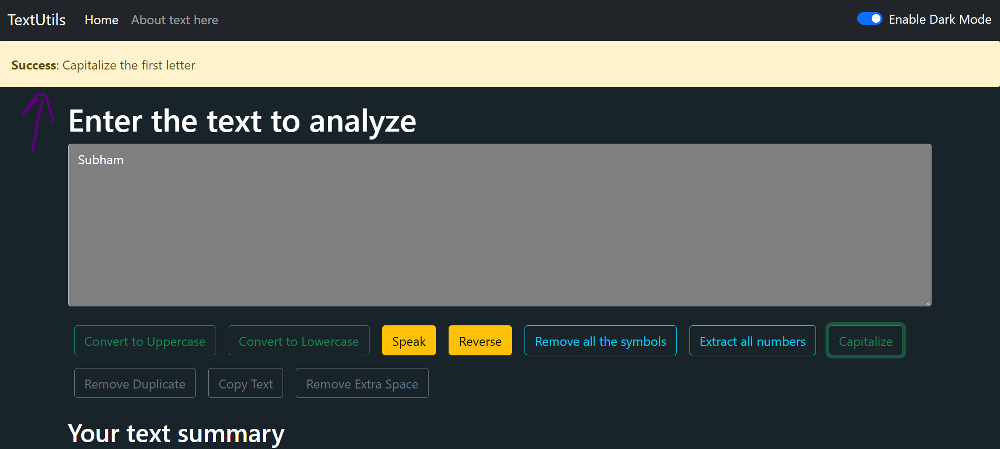

### **Adding Dismissing Alert Message**

Visit [getbootstrap.com](https://getbootstrap.com/docs/5.0/getting-started/introduction/) and get a dismissible alert from the components section. Earlier, we learnt how to copy-paste any code from bootstrap.

```html
<div class="alert alert-warning alert-dismissible fade show" role="alert">
  <strong>Holy guacamole!</strong> You should check in on some of those fields below.
  <button type="button" class="btn-close" data-bs-dismiss="alert" aria-label="Close"></button>
</div>
```
#### **Create Alert.js:**

Create alert.js in the components folder, also generate a react function-based component in it and paste the code of dismissible alert in the return().


### Passing values as a prop 

We will be passing values in alert.js as a prop. For example, we can send text, objects, etc to our "props.alert". To make the text bold you can put it inside &lt;strong>&lt;/strong> tag.
<p align="center">
        
        </p>
Figure1.1: Using Props in Alert.js


### In app.js

We have created our Alert component and to render it in our application we will use &lt;alert/> in return(). Make sure your "Alert" component has been imported into "app.js".


### **Passing Text in props.alert from app.js**

We are passing the ‘This is alert’ text to props.alert of the alert component as:


```jsx
<Alert alert= 'This is alert'/>
```


Our text will be displayed in the alert.


### **Passing Values as a State**

But we would like to pass text as State, for that we will create a State variable named "alert".


```jsx
const [alert, setAlert] = useState(initialState)
```


Here, alert is an object whose initial value is null. We can define value in the alert state variable by using the "setAlert" method and we will be using the "showAlert" method to display the alert.


### **showAlert Function**


```jsx
const showAlert = (message, type) => {
    setAlert({
        msg: message,
        Type: type
    })
}
```


We have passed two arguments in the object which are ‘message’ and ‘type’. The ‘type’ is actually the status of our action, like success, warning, etc. The ‘message’ is the text which will be displayed like copied to the clipboard, Dark mode is enabled, etc.


### **Showing alert while performing the action**

Now, we want to display this alert while enabling and disabling dark mode as well as when we call the functions of textform.js. To do so we will firstly pass alert to our Alert component instead of the text like this.


```jsx
<Alert alert={alert}/>
```


Here, The ‘alert’ is the object which we have created.


### In Alert.js

We have passed the alert object to our Alert.js. Now to render the ‘type’ value of object use {props.alert.type} and to display the value of ‘msg’ use {props.alert.msg}.

<p align="center">
        
        </p>

Figure1.2: Passed alert object to alert.js

If props.alert is null then the code written after "&&" won’t be shown otherwise the code inside &lt;div>&lt;/div> tag will be displayed.


### **To show alert while changing modes**

We would like to show the alert while switching between the dark and the light mode. For that add the show alert function to the if-else statement of the Tooglemode call back function like this:


```jsx
const toggleMode = () => {
    if (mode === 'light') {
        setMode('dark');
        document.body.style.backgroundColor = 'grey';
        showAlert("Dark mode has been enable", "success")
    }
    else {
        setMode('light');
        document.body.style.backgroundColor = 'white';
        showAlert("Light mode has been enable", "success")
    }
```
<p align="center">
        
        </p>


In the above case, we have called the showAlert function to display our alert message while interchanging the light and dark mode.

<p align="center">
        
        </p>

Figure1.3: Result of the above function


### **Change the color of the Alert box**

You can simply change the color of the box by changing the code of bootstrap in Alert.js. For example, to show green color bootstrap used the ‘success’ keyword, for red color it takes the ‘danger’ keyword and so on.

<p align="center">
        
        </p>

Figure1.4: Using Javascript to change color

Here, By using Javascript we have changed the keyword ‘warning’ with the word which we have passed in the ‘type’, that is Success.

Result: You will find that the color of the box has turned green as for bootstrap ‘Success’ depicts the green color.


<p align="center">
        
        </p>

Figure 1.5 Color of Alert has changed


### **Capitalizing the First character**

We would like to capitalize ‘s’ letter of success. To do so we would create a capitalize function


```jsx
const capitalize = (word) => {
    const lower = word.toLowerCase();
    return lower.charAt(0).toUpperCase() = lower.slice(1);
}
```


To use the Capitalize function, we would use the below code:


```jsx
{capitalize(props.alert.type)}
```

<p align="center">
        
        </p>

Figure 1.6: Using the Capitalize Function

The ‘S’ character of the success word will be capitalized.


### **Show Alert message while using the features**

You might want to show a message of success to the user when they use the functions of our application by clicking on the buttons.

To do so we have to pass showAlert to our Texform component like this:


```jsx
<TextForm showAlert={showAlert} heading="Enter the text to Analyze below" mode={mode}/>
```


#### **In textform.js**

In every handler of our application, we can use this showAlert method as:

For example: Add show Alert to ‘handleLoclick’.


```jsx
props.showAlert("Converted to uppercase!", "success");
```


By doing so when someone clicks on the Convert to Uppercase button, then the passed alert message will be displayed. In a similar fashion, you can pass the showALerhowAlert function to other handlers.


1. For ‘handleClearclick’


```jsx
props.showAlert("Text Cleared!", "success");

```


1. For ‘handle’


```jsx
props.showAlert("Copied to clipboard", "success");

```


1. For ‘handleExtraSpaces’


```jsx
props.showAlert("Extra spaces removed", "success");
```

<p align="center">
        
        </p>


### Set Timeout for the Alert

You might have noticed after dismissing the alert through the close button you aren’t able to see the alert again with reloading the page.

To fix this issue we would use the ‘setTimeout function’ of javascript

Tip: You can delete the code of the cross button as we are going to automatically dismiss the alert after a specific amount of time.


### In app.js

We would use ‘set timeout’ to the showAlert function as:
```jsx
    const showAlert = (message, type)=>{  // showAlert that helps to show the message
     setAlert({
         msg: message,
         type: type
     })
     setTimeout(()=>{
         setAlert(null);
     }, 1749);
    }
```

<p align="center">
        
        </p>

Figure 1.7: Adding setTimeout to showAlert function

Result: In our application, If a user interchanges the modes or uses any feature of our application then an Alert message will be shown to him/her which will automatically disappear after 1.5 seconds.
