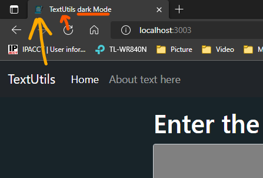

## Changing Title and Meta Description
Open "index.html" available in the public folder. In "index.html" we can easily change the meta description as well as the title of our application. You can enter your desired description and title in the meta tag and title tag of "index.html" respectively.

<p align="center">
        
        </p>
Figure 1.1: Changing Title and meta Description

## Changing Favicon
If you already have your favicon then you can simply copy-paste it inside the Public folder. In our case, We will be generating the favicon online by converting an image to ".ico" file format. ico is the file format used for computer icons. Once we have downloaded the icon then we can easily copy the "favicon.ico" file as well as the image, which we are going to use, and paste it inside the public folder of our React application. In index.html replace the old name of the image with your desired one.

**Result: Our default Favicon will be changed with our desired one.**

## Changing Title While switching Mode
Now we would like to change the title of the application whenever we are switching between the dark and light modes. To do so visit "app.js" in the "src" folder and add "document.title" to your toggle mode function, which is responsible for changing modes of our application.

## Toggle Mode Function
```jsx
const toggleMode = () => {
    if (mode === "light") {
        setMode("dark ");
        document.body.style.backgroundColor = "#042743"
        showAlert("Dark mode has been enabled", "success");
        document.title = "TextUtils - Dark Mode";
    }
    else {
        setMode("light");
        document.body.style.backgroundColor = "white"
        showAlert("Light mode has been enabled", "success");
        document.title = "TextUtils - Light Mode";
    }
}
```
**Explanation:** Here, in our Toggle Mode function, we have added a "document.title" which means that a specific title will be displayed when the given setMode is executed. In the above case, it means that if the Dark mode is being enabled then set document title as ‘TextUtils-Dark mode’ and hence for the light mode set the title of the document as ‘TextUtils-Lightmode’.

**Result:** On interchanging between light and dark mode, you will notice that the document title also changes. So now we have learned how to change document titles dynamically.

## Changing Title After specific Time interval
If you want to change the title after a specific time interval then you can use the "setInterval" method as follows:

```jsx
const toogleMode = () => {
    if (mode === "light") {
        setMode("dark ");
        document.body.style.backgroundColor = "#042743"
        showAlert("Dark mode has been enabled", "success");
        document.title = "TextUtils - Dark Mode";
        setInterval(() => {
            document.title = "TextUtils  is Amazing";
        }, 2000);
        setInterval(() => {
            document.title = "Install TextUtils";
        }, 1500);
    }
}
```
Here, we have used the setInterval method to repeat the specific function after a given interval. In the above case, after a given interval, the Title of the document will inter-change between ‘TextUtils is Amazing’ and 'Install TextUtils’.

Remember, this type of feature never provides the user with a good experience.
