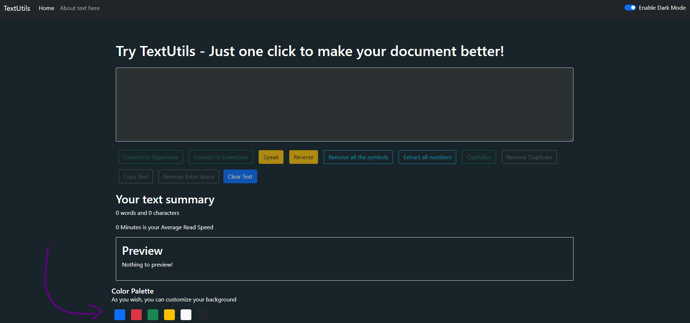
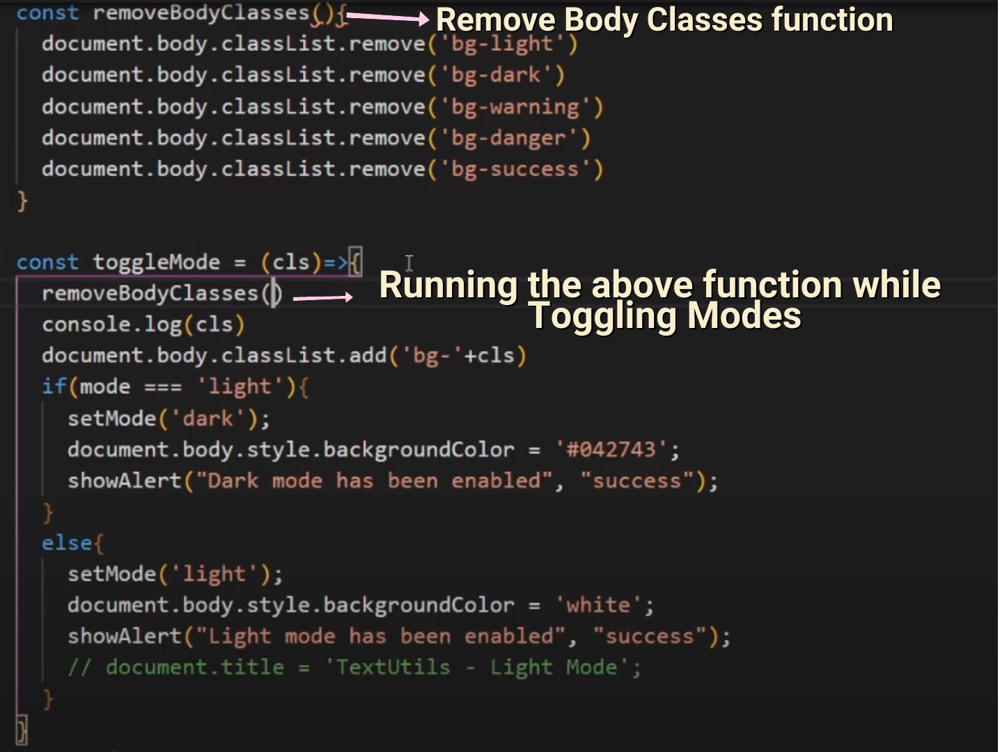

## 1. Adding Another Toggle Mode Function
If you remember toggle mode was the function, which was responsible for switching between dark and light mode and we have assigned it to our ‘Enable Dark Mode’ Switch. We need to make some changes to that function so that while clicking on the desired palette it changes the background of the application to that specific color.

```jsx
 const toggleMode2 = (cls)=>{
    removeBodyClasses();
    console.log(cls)
    document.body.classList.add('bg-'+cls)
    if(mode === 'light'){
        setMode('dark');
        document.body.style.backgroundColor = '#042743';
        showAlert("Dark mode has been enabled", "success");
    }
    else {
        setMode('light');
        showAlert("Light mode has been enabled", "success");
        document.title='TextUtils light Mode';
    }
}
```
Explanation: We have assigned a class(‘cls’) parameter in the toggle mode function. ‘cls’ will be the value that we want to set our mode as. Suppose, you click on the primary button having this function, then this function will be invoked with the ‘cls’ value as primary. This means that the background color will be ‘blue’ and the ‘primary’ keyword will be printed in the console, as we have used ‘cls’ with them.

## 2.Creating a Custom Color palette
1. create ColorPallet.js in the components folder
2. We would be creating the custom palettes in the Navbar so let’s open Navbar.js and add some buttons. We are adding blue, Yellow, Red, Green buttons as:
3. Blue palette:
````jsx
<div className="bg-primary rounded mx-2" onClick={props()=>{props.toggleMode('primary')}} style={{height:'30px', width:'30px', cursor: 'pointer'}}></div>
````
Green palette:

````jsx
<div className="bg-success rounded mx-2" onClick={props()=>{props.toggleMode('success')}} style={{height:'30px', width:'30px', cursor: 'pointer'}}></div>
````
Red palette:

````jsx
<div className="bg-danger rounded mx-2" onClick={props()=>{props.toggleMode('danger')}} style={{height:'30px', width:'30px', cursor: 'pointer'}}></div>
````
Yellow palette:

````jsx
<div className="bg-warning rounded mx-2" onClick={props()=>{props.toggleMode('warning')}} style={{height:'30px', width:'30px', cursor: 'pointer'}}></div>
````
Similarly, You can create a palette of your desired Colors.


Explanation: In the above code, We have assigned the ToggleMode function to the Onclick properties of the buttons.


For example, On clicking the primary button the Toggle Mode function will be invoked with the ‘cls’ value as primary. Remember we have used ‘cls’ in console.log() and also with background color, so the background color of the application will turn ‘Blue’, and the ‘primary’ keyword will be printed in the console.

In a similar fashion, the toggle mode function will be invoked for other keywords, such as warning, danger, success, etc, as well.

padding Related: https://getbootstrap.com/docs/4.3/utilities/spacing/
````jsx
import React from 'react';

function ColorPallet(props) {
    return (
        <>
            {/*< className= "container" style={{color: props.mode==='dark'?'white':'#182429'}}>*/}

            <div className="mb-8"style={{color: props.mode==='dark'?'white':'#182429'}}>

                {/*<fieldset className="border border-200 p-3">*/}
                <h5 className="mt-5">{props.heading}  </h5>
                <p className="mb-3">{props.subHeading}</p>
                <div className="d-flex " >

                    <div className="bg-primary rounded mx-2" onClick={()=>{props.toggleMode2('primary')}} style={{height: '30px', width:'30px', cursor: 'pointer'}}></div>
                    <div className="bg-danger rounded mx-2" onClick={()=>{props.toggleMode2('danger')}} style={{height: '30px', width:'30px', cursor: 'pointer'}}></div>
                    <div className="bg-success rounded mx-2" onClick={()=>{props.toggleMode2('success')}} style={{height: '30px', width:'30px', cursor: 'pointer'}}></div>
                    <div className="bg-warning rounded mx-2" onClick={()=>{props.toggleMode2('warning')}} style={{height: '30px', width:'30px', cursor: 'pointer'}}></div>
                    <div className="bg-light rounded mx-2" onClick={()=>{props.toggleMode2('light')}} style={{height: '30px', width:'30px', cursor: 'pointer'}}></div>
                    <div className="bg-dark rounded mx-2" onClick={()=>{props.toggleMode2('dark')}} style={{height: '30px', width:'30px', cursor: 'pointer'}}></div>

                </div>
                {/*</fieldset>*/}
            </div>
        </>
    );

}

export default ColorPallet;

````

Here we use this for changing color of the components.
```jsx
<div className="mb-8"style={{color: props.mode==='dark'?'white':'#182429'}}>
```

## 3. Remove Body Classes

**Bug:** You might have noticed that you are unable to use the complete palette without reloading the page. This issue occurs as once we have entered our class(‘cls’) to the function, that is we have clicked on any palette, then a new background class(‘cls’) will be ignored until and unless the old class is removed.

**Solution:** To solve this issue we would create a function removeBodyClasses. This function will remove all the classes from the document.body. The function is as follows: 

````jsx
const removeBodyClasses = ()=>{
    document.body.classList.remove('bg-light')
    document.body.classList.remove('bg-dark')
    document.body.classList.remove('bg-warning')
    document.body.classList.remove('bg-danger')
    document.body.classList.remove('bg-success')
}
````



## 4. Remove the route from app.js(bug fix)
for this our text form was not working at starting
```jsx
   <Switch>
                        {/* /users --> Component 1
        /users/home --> Component 2 */}
                        <Route exact path="/about">
                            <About mode = {mode} />
                        </Route>
                        {/*<Route exact path="/">*/}
                            <TextForm showAlert={showAlert} heading="Try TextUtils - Just one click to make your document better!" mode={mode} toggleMode ={toggleMode}/>
                        {/*</Route>*/}
                    </Switch>
```

## 5. Call the component in the App.js
```jsx
           <Switch>
                        {/* /users --> Component 1
        /users/home --> Component 2 */}
                        <Route exact path="/about">
                            <About mode = {mode} />
                        </Route>
                        {/*<Route exact path="/">*/}
                            <TextForm showAlert={showAlert} heading="Try TextUtils - Just one click to make your document better!" mode={mode} toggleMode ={toggleMode}/>
                        {/*</Route>*/}
                    </Switch>
                    <ColorPallet showAlert={showAlert} heading="Color Palette " subHeading="As you wish, you can customize your background  " mode={mode} toggleMode2={toggleMode2} />
                </div>

//here we are calling the component in the App.js
            </Router>
```

## 6. Adding ```</fieldset>``` in the text form for adding a box around the text
```jsx
  <fieldset className="border border-200 p-3"> <h2>Preview</h2>
               <p>{text.length>0?text:"Nothing to preview!"}</p></fieldset>
            </div>
```