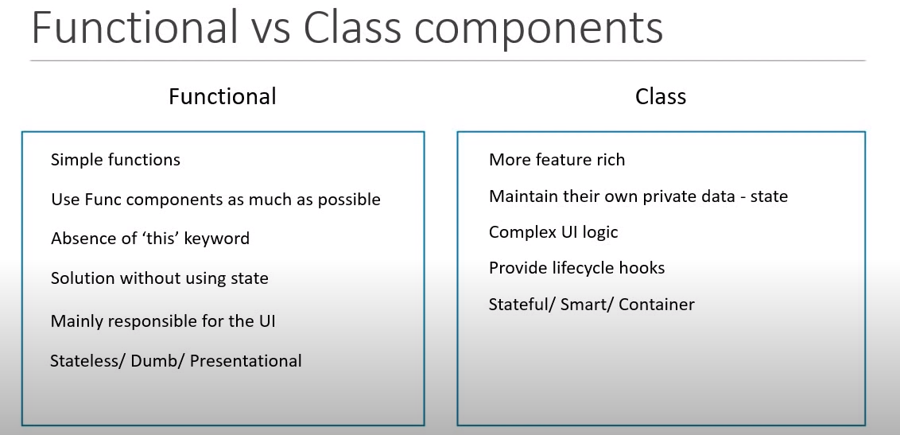

# Create a React App
Open Windows Powershell (shortcut: Shift + Right-click in folder ) and use npx create-react-Newsapp command to create a new React app. We have already studied the folder structure of a React app and also know that "app.js" is the file that has our app component.

# Class-based components
Class components are basically ES7 Classes. A class Component can also receive props as Input and return HTML. A class component can also maintain some information that is private to that component and can use that information to describe the user interface. 
# Creating class component:
Now, whenever you create a class component, we need to include two imports that are the React and the Component class from React like this:

```
import React, { Component } from 'react'
```
After this, you have to just define a class. Remember that for a class to become a react component. There are two simple steps. The first step is that it should extend the component class from React. Secondly, The class has to implement a render method that will return null or some HTML. Code:

```
export default class App extends Component {
    render() {
        return (
            <div></div>
        )
    }
}
```
Hence, we have successfully created our class component! 

Note: To save our time, Instead of writing such lengthy code, we can use Snippets. To use a snippet, just install the ES7 React/Redux/GraphQL/React-Native snippet extension in your VS Code.

In app.js:

Now to generate the class-based component skeleton, you can simply use the ‘rcc’ snippet. This feature occurs as we have installed the above extension. We can render the content and components in our application by writing some JSX.

# Difference between Function and Class-based Component:
You might be wondering what the advantage of using one over the other is and when exactly you should use a particular component. Below is the image discussing these points, but you have to keep in mind that you might only partially understand the discussion, and it is completely fine at this moment as we are listing down the topics which we haven’t covered yet.


