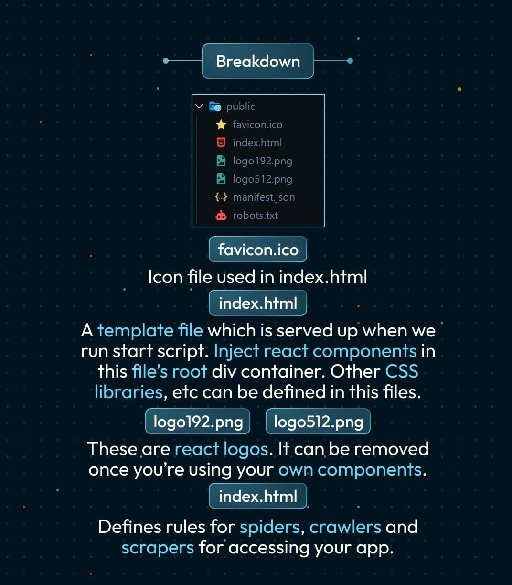
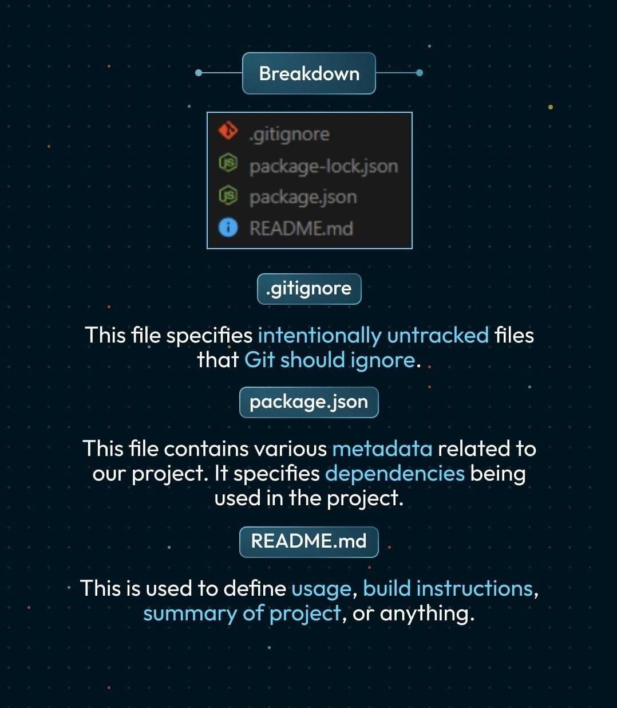
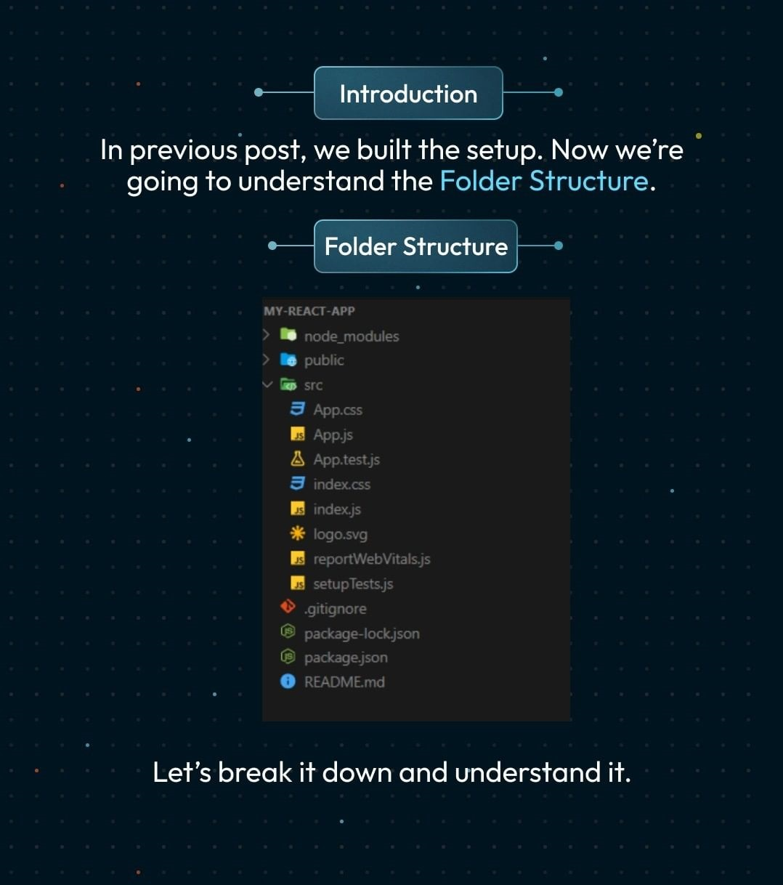
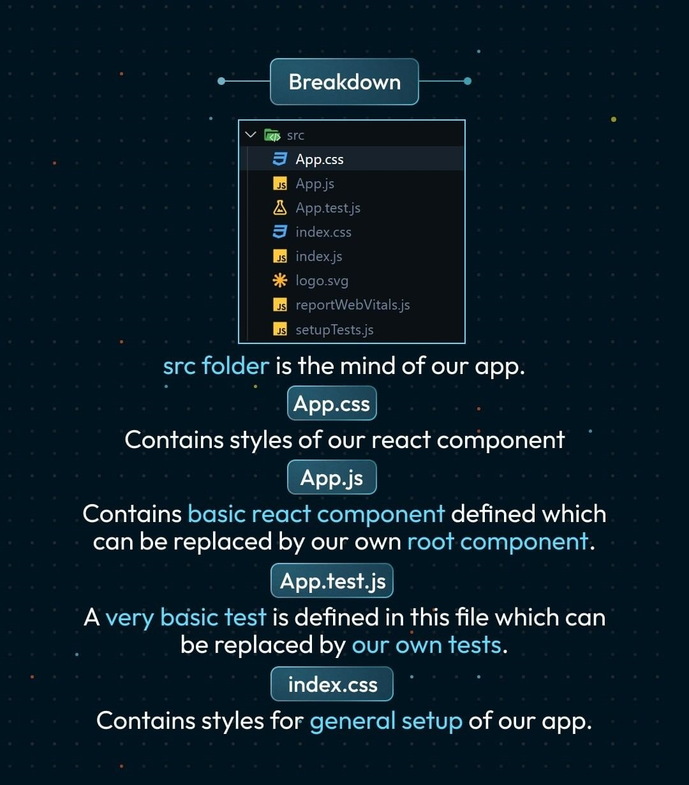

# 1. npm: 

It stands for Node Package manager. It helps in Installing Packages in NodeJS.

We can use NPM to install React app on our computer globally. But, we would be using the create-react-app command only once. So, Using npm will only lead to the consumption of our hard disk storage capacity, and hence we will be using npx instead of npm.
```
npm install -g create-react-app
```
# 2. npx: 


It is an npm package that is expected to be run only once in a project. In short, it allows you to use the Package without downloading it.

Write the following command in Your VS Code Terminal. 

```
 npx create-react-app my-app
```

Now just delete the app and type this in your terminal

Textutils is the name of our app. After running the command, a folder named textutils will be created.

```
npx create-react-app textutils
```

# 3. Folder Structure of Textutils(Our React App):







- node_modules: It contains all the packages, which are used by React app.


- .gitignore: It contains the files, which you do not want to push in Github.


- package.json: Contains all the packages which are installed in Node modules.


- readme.md: It provides the basic info about your app.

## The two folders in which we are interested are :

1. "public" folder: It contains an Index.html file.

index.html: It is the main HTML file of our react app. This is the page that is displayed on starting our application. It has an empty div tag like this:

```html
 <div id="root"></div>
 ```
Here, we will be rendering data from components available in the src folder with the help of JavaScript.

- "src" folder: Most of the time, we will be writing our code in the src folder. 
Two most important files in the src folder are:

- index.js: This is the entry component of our app. It has the code of what to render and where.
- app.js: With the help of Index.js, the content and changes in it are delivered to the mentioned element.

# 4. How to run your React app?

In index.js, open the terminal and write 
```
npm start
```
 and your react app will be served at localhost:3000. You can make changes to the content of your React app in App.js. You can use npm run build if you are creating an app for production.


# 5. Component-based architecture of React:
In React, we create our app by dividing it into different components. We can create components of our app individually and can reuse them again and again. 

For Example: In the below Image, we have structured our app into the header, footer, body, and right navigation bar.

<p align="center">
        
        </p>


You can structure and design your react components as per your choice

## Advantage of dividing our app into components:

By dividing your app into components, you can reuse the component in the same or different app repeatedly. 
We can change the component of our app using Props and State.
It also makes it easier to find errors in a large set of your code.
