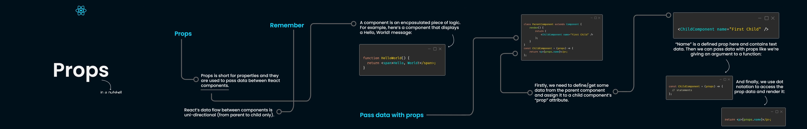

* ##  Named export and Default Export:

### 1. Default Export: 
In this case, if import occurs by any name, Suppose XYZ, then the default value will be exported. It is generally used to export a single object, function, or variable. Let’s understand with an example-

Create two files. We are creating module.mjs and module2.mjs. We will be performing a default export from module.mjs to module2.mjs

**note**: you can't make a name with js extension if you try to compile it will throw and error


In **module.mjs:**
```jsx
// module.mjs - This is an example of a Default export
const a = 'Subham';
const b = 'Rachita';
const c = 'Aakansha';
const d = 'Subhasish';
const e = 'Bikram';
export default b;
```


In **module2.mjs:**

```jsx
import XYZ from './module.js'
console.log(XYZ);
```
When you do in your terminal
```
node module2.mjs
```
The default exported value, which is ```‘Rachita’```, will be imported. In default Export, the name of Import is Independent of the name of Export

### 2. Named Export:
In this case, we export some specific values. The name of import is dependent on the name of Export which means You can’t use a different name in the Import and Export function. We use Curly brackets for Named export. For example: performing the same export using named export.

In **module.mjs:**
```jsx
const a = 'Subham';
const b = 'Rachita';
const c = 'Aakansha';
const d = 'Subhasish';
const e = 'Bikram';
export default b;
```

In **module2.mjs**:
```jsx
import dza, {a, c, d} from './module2.mjs'
console.log(dza);
console.log(c);
console.log(d);
```
When you do in your terminal
```
node module2.mjs
```
Output will be```‘Rachita’```,```Aakansha``` ,```Subhasish``` .  Name Exports are used to export multiple values.
*********************
* ## Creating Navbar Component:
1. Create a components folder(in src folder) and create Navbar.js, which is the Navbar component of our React app. 
2. ReactFunctionalComponent shortcut -> ``rfc`` for vscode ```rsf```  for webstorm (open navbar and type rfc/rsf according to your ide)
3. **In app.js:** We will use the Navbar component by writing ```<Navbar/>``` inside return(). Navbar Component will be automatically imported in App.js.
4. For making a component , easier to find errors in a large set of  code and reuse the component in the same or different app again and again. (navbar) -> 
- ``cut``  the code ```<nav>.... </nav>``` in your App.js file and paste the code ```<nav>.... </nav>``` in your Navbar.js inside return like this ```function Navbar(props) {
  return (<nav>.... </nav>);
  } ``` 

- now in your App.js only present 

```jsx
import Navbar from "./components/Navbar";
function App() {
return (
<>
    <Navbar/>
</>
);
}
```
5. Changing Values Using Props - Suppose you want to use the above navbar in your different applications but with different titles and About, or pass New values to your existing Navbar

- Creating Props in App.js 

In app.js:

Passing values: You can pass the values in the created props as shown below: 

```jsx
import Navbar from "./components/Navbar";


function App() {
    return (
        <>

            <Navbar title = "TextUtils" aboutText = "About TextUtils"/>
        </>
    );
}

export default App;
```
Here, we have passed the ‘Textutils’ in props.title and ‘About Textutils’ in props.aboutText.

Now we have created such a React Navbar component, whose title and About can be easily changed by using props. Remember, we can even pass objects or links, etc., in our component. You should never directly change the value of props.


- In navbar

In navbar pass props as a parameter in the navbar function and change
```<a className="navbar-brand" href="/">Title</a>```  to ```<a className="navbar-brand" href="/">{props.title}</a>``` means 
props.(the argument which you called from app.js-> navbar tag) 

```jsx
// navbar.jsx
import React from 'react';

export default function Navbar(props) {
    return (
   
<a className="navbar-brand" href="/">{props.title}</a>

<a className="nav-link" href="/">{props.aboutText}</a>


);
}

```

6. **Prop-type:**
  Firstly, we need to import prop types to do so, use this command
```jsx
import PropTypes from 'prop-types'
```
- String/object/Number Prop-Type

It means that my prop-type of title is a string which means on passing any other value, like Number, it will show an error in the console. Hence we can only pass a string in props.title and props.aboutText. We can use ‘isrequired’ keyword, which makes sure that we won’t leave that prop blank. If you do so, it will show an error in the console. Similarly, you can use an object, Number, etc. prop-type as well.
```jsx
Navbar.propTypes = {
    title: propTypes.string,
    aboutText: propTypes.string,
};
```
if you want as mandatory put the string value then use string function like this (for this remove default prop either you can't see any error)
```jsx
Navbar.propTypes = {
    title: propTypes.string.isRequired,
    aboutText: propTypes.string,
};
```
- Default Prop-Type
```jsx
navbar.defaultProps = {
    title: 'Set title here',
    aboutText: 'About text here'
};
```
If no props are being passed in the component, then the Default content in this prop-type will be displayed.


### So in navbar I add this to identify error

```jsx
Navbar.propTypes = {
    title: propTypes.string,
    aboutText: propTypes.string,
};
```