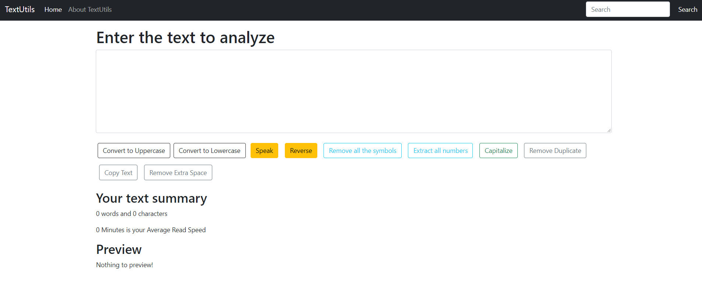

1. speak functionality

```jsx
const speak = () => {
  let msg = new SpeechSynthesisUtterance();
  msg.text = text;
  window.speechSynthesis.speak(msg);
}
// It is targetted by the button 'speak':

<button type="submit" onClick={speak} className="btn btn-warning mx-2 my-2">Speak</button>
```

2.Function to reverse text
```jsx

  const handleReverse = (event) => {
    /* Convert string to array*/
    let strArr = text.split("");
    /* Reverse array*/
    strArr = strArr.reverse();
    /* Convert array to string*/
    let newText = strArr.join("");
    setText(newText);
  };
  // It is targetted by the button 'handleReverse':
  <button type="submit" onClick={handleReverse} className="btn btn-warning mx-2 my-2">Reverse</button>
```

3.Remove all the symbols
```jsx
const handletextExtract =()=>{
        const regex = /[0-9/A-Z/a-z/ /]/g;

        const letters = text.match(regex);
        const res1 = letters.join('');
        setText(res1)
        };
 // It is targetted by the button handletextExtract
<button type="submit" onClick={handletextExtract} className="btn btn-outline-info mx-2 my-2">Remove all the symbols</button>
```

4.to extract only the numbers in the text:
```jsx
const handleNumExtract =()=>{
        const regex = /[0-9/ /]/g;

        const digits = text.match(regex);
        const res = digits.join('');
       setText(res)
        };
// It is targetted by the button handleNumExtract
<button type="submit" onClick={handleNumExtract} className="btn btn-outline-info mx-2 my-2">Extract all numbers</button>
```

5. to capitalize the first character of any string

```jsx
    const capitalize = () => {
        
        let firstchar = text.charAt(0); // storing the first char of the string
        let newText= firstchar.toUpperCase(); // converting that to uppercase
        setText(newText+text.slice(1)); // printing it with rest excluding the first char by using slice

    }
// It is targetted by the button capitalize
<button type="submit" onClick={capitalize} className="btn btn-outline-success mx-2 my-2">Capitalize</button>
```

6. Remove duplicate words from the string

```jsx
    const onRemoveDuplicatesClick = (e) => {
        let newText = text.split(' ').filter(function(item,i,allItems){
            return i === allItems.indexOf(item);
        }).join(' ');

        setText(newText)
    }
// It is targetted by the button onRemoveDuplicatesClick
<button type="submit" onClick={onRemoveDuplicatesClick} className="btn btn-outline-secondary mx-2 my-2">Remove Duplicate</button>
```
7. Copy Text

```jsx
    const COPYIT=(event)=>{
    setText(event.target.value);
    let newtext=navigator.clipboard.writeText(text);
    console.log(newtext);
    alert("text copied successfully");

};
// It is targetted by the button COPYIT
<button type="submit" onClick={COPYIT} className="btn btn-outline-secondary mx-2 my-2">Copy Text</button>
```

Alternative

```jsx
    const handleCopy = () => {
        navigator.clipboard.writeText(text);
        props.showAlert("Copied to Clipboard!", "success");
    }
    // It is targetted by the button handleCopy
<button type="submit" onClick={handleCopy} className="btn btn-outline-secondary mx-2 my-2">Copy Text</button>
```

8. Remove Extra Spaces
```jsx
    const handleExtraSpaces = () => {
        let newText = text.split(/[ ]+/);
        setText(newText.join(" "));
        props.showAlert("Extra spaces removed!", "success");
    }
// It is targetted by the button handleExtraSpaces
<button type="submit" onClick={handleExtraSpaces} className="btn btn-outline-secondary mx-2 my-2">Remove Extra Spaces</button>
```
