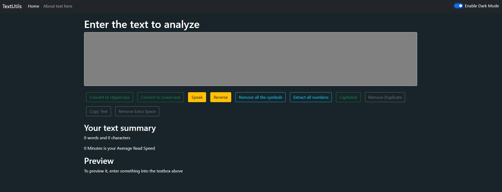

### **In app.js:**

In our app.js we will create a new state


```jsx
const[Mode, setMode] = useState('light');
```


Here, by default _light _mode State is used and We would like to pass this mode to our Navbar component


```jsx
<Navbar title="TextUtils" mode={Mode} />
```


We have passed it to our Navbar Component. Let’s now render this mode at props.mode (Creating it) in our Navbar.


### **What do we want?**

We want that when our darkMode is true then, the color of our Navbar container becomes dark that is the below code of dark code is implemented otherwise the default light mode will be enabled.


```jsx
// For Dark mode
<nav ClassName="navbar navbar-expand-lg navbar-dark bg-dark">
//For light Mode
<nav ClassName="navbar navbar-expand-lg navbar-light bg-light">
```


But how we will interchange the color of our component between dark and light. For that we will write the code of this string with javascript like this:


```jsx
<nav ClassName= {`navbar navbar-expand-lg navbar-${props.mode} bg-${props.mode}`}>
```


We are using backticks so we can use template literals [Syntax: ${}] inside a string. Template literals are used for various purposes but here we are using them to store variables in a string. In this case, we have used $ to use props.mode as a variable and the curly brackets to specify that this is a JavaScript Code.


Result: Now, we can change the text of Use state between dark and light as a result it will change the color of our Navbar between dark and light.


### **What have we done?**

We have created a state ‘Mode’. The default value of the state is light. This value is passed to our Navbar props.mode, Which is actually the color of our Navbar. Hence, On changing the color in the defined state in app.js the color of the Navbar changes.


### **Assigning Switch:**

We don’t want to change the value in our useState again and again. Instead, we would use a switch to interchange dark and light mode.

Add the switch to our Navbar by using this code:

Switch:


```jsx
<div className={`form-check form-switch text-${props.mode==='light'? 'Dark' : 'light'}`}>
    <input className="form-check-input" onClick={props.toogleMode} type="checkbox" id="flexSwitchCheckDefault" />
    <label className="form-check-label" htmlFor="flexSwitchCheckDefault">Enable DarkMode </label>
</div>
```


Explanation: In the Parent className we have used Ternary Operators. Ternary Operators are used for decision-making in place of longer if and else conditional statements. We have used it to change the color of the text while changing the mode for better visibility. A togglemode function is assigned to the button which will be invoked on clicking the button.


### **Creating Function:**

Now we would create a function named ‘toggle mode’ which we will pass to our Navbar from app.js. Our toggle mode function will change the mode with dark if our mode is light or vice versa.


### **In app.js:**


#### **The Toggle Mode Function:**


```jsx

const toggleMode = () => {
    if (mode === 'light') {
        setMode('dark');
    }
    else {
        setMode('light');
    }
};
```


Hence, our function is created and assigned to the switch.

Result: We are able to change the color of our Navbar by turning on/off the switch. More importantly, we are able to do this from app.js.
<p align="center">
        
        </p>

Figure 1.1: Enable light/dark mode for Navbar


#### **Enabling Dark mode for body:**

In a similar fashion, we can add a dark mode for the body of our application by using app.js.

For example, we would change the background color of the body by simply adding two more lines of code to our function:


```jsx
const toggleMode = () => {
    if (mode === 'light') {
        setMode('dark');
        document.body.style.backgroundColor = 'grey';
    }
    else {
        setMode('light');
        document.body.style.backgroundColor = 'white';
    }
};
```


Now if we click on the button then the color of the navbar becomes black and the color of the entire body of our application becomes grey as shown below:

<p align="center">
        
        </p>

Figure 1.2: Dark mode for Body


#### **Changing Color of Text and Textbox:**

Now we would like to change the color of the textbox to grey and the color of the text to white for better visibility.


* To do so we will pass the mode state variable to textform.js to add information about the dark mode and light mode. For that use the following code in app.js:


```
<Textform heading="Enter the text to analyze below" mode={mode}/>
```


### **In textform.js:**

We would change the CSS(color) of text with the help of Javascript to make it functional in the response of the dark and light mode. In short, We would like to change the color of the text to white when dark mode is enabled and vice-versa.


#### **Changing Text Colour:**

Changing CSS of the parent container and other containers.


```
style={{color: props.mode==='dark'?'white':'black'}}
```


Explanation: In the above code we have used Ternary operators. The above code changes the color of the text in response to the mode enabled.


#### **Changing the Background Colour of the Textbox:**

Our textbox is appearing white, but we would like to change its color to grey for that we would use the following code:


```
style={{backgroundcolour: props.mode==='dark'? 'Grey': 'white', color:props.mode=== 'dark'?'white': 'black'}}
```


Explanation: The above code changes the background color of the textbox according to the mode which is being enabled. For example, if dark mode is enabled then the background color of the Textbox will be grey otherwise white.

Result: Our application after changing text color and the color of the textbox.

<p align="center">
        
        </p>
Figure 1.3: Text and box color changed


#### **Editing Preview Section:**

If the preview is empty we would like to see some default text written there, For that we can use the below command:


```
<h2>Preview<h2>
<p>{text.length>0?text:"Enter something in the above textbox to preview it here"}</p>
```


Result: Our application appears something like this on enabling dark mode.

<p align="center">
        
        </p>

Figure 1.4: Our Application

If you would like to use other colors instead of black and grey then simply replace the color with your desired one.

<p align="center">
        
        </p>


